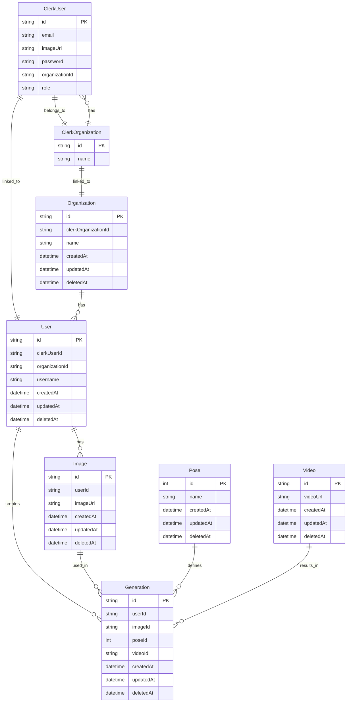

```mermaid
erDiagram
  ClerkUser ||--|| ClerkOrganization : belongs_to
  ClerkOrganization ||--o{ ClerkUser : has
  ClerkUser ||--|| User : linked_to
  ClerkOrganization ||--|| Organization : linked_to
  Organization ||--o{ User : has
  User ||--o{ Image : has
  User ||--o{ Generation : creates
  Image ||--o{ Generation : used_in
  Pose ||--o{ Generation : defines
  Video ||--o{ Generation : results_in

  ClerkUser {
    string id PK
    string email
    string imageUrl
    string password
    string organizationId
    string role
  }

  ClerkOrganization {
    string id PK
    string name
  }

  Organization {
    string id PK
    string clerkOrganizationId
    string name
    datetime createdAt
    datetime updatedAt
    datetime deletedAt
  }

  User {
    string id PK
    string clerkUserId
    string organizationId
    string username
    datetime createdAt
    datetime updatedAt
    datetime deletedAt
  }

  Image {
    string id PK
    string userId
    string imageUrl
    datetime createdAt
    datetime updatedAt
    datetime deletedAt
  }

  Pose {
    int id PK
    string name
    datetime createdAt
    datetime updatedAt
    datetime deletedAt
  }

  Video {
    string id PK
    string videoUrl
    datetime createdAt
    datetime updatedAt
    datetime deletedAt
  }

  Generation {
    string id PK
    string userId
    string imageId
    int poseId
    string videoId
    datetime createdAt
    datetime updatedAt
    datetime deletedAt
  }
```
